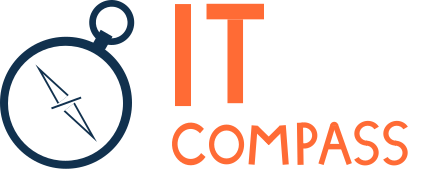

# 🧭 IT Compass

**IT Compass** is a web application designed to calculate ratings of Russian subjects for IT specialists, tailored to their qualification levels and based on objective metrics.

🚧 **Status:** Under active development.

## 🛠️ Tech Stack

### Backend

### Frontend

## 🗄️ Database commands

**Note:** All commands below must be run from `/backend` directory.

| Command | Description |
| ------- | ----------- |
| uv run python -m scripts.db_cli setup | Create database and table and load data |
| uv run python -m scripts.db_cli clear | Clear table data |
| uv run python -m scripts.db_cli refres | Refresh table data |

## 🗺️ Roadmap

- **Interactive Map:** A map of Russia featuring a color gradient (from red to green) and informational infoboxes triggered upon clicking a subjects.
- **Profile Selection:** Career level switching (`Applicant`, `Intern`, `Junior`, `Middle`, `Senior`) with dynamic metric weight recalculation tailored to specific priorities.
- **Top 10 Subjects:** A ranked list of the best subjects in the Russian Federation for the selected profile, showing position, name, and total score.
- **Subjects Comparison:** Detailed side-by-side comparison of two subjects with an automatically determined winner based on individual metrics.
- **Subjects Search:** A search input field with real-time highlighting of the selected subjects on the map.

## 🪪 License

Distributed under the MIT License. See `LICENSE.txt` for more information.